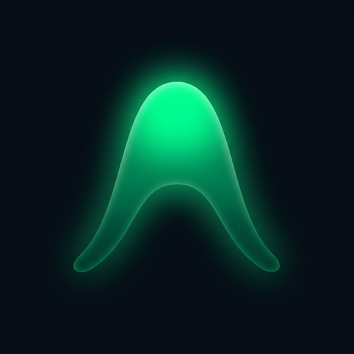
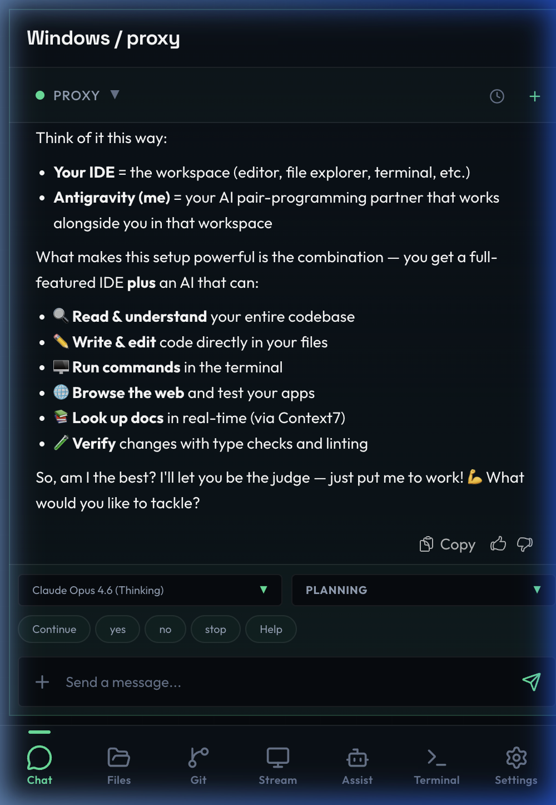
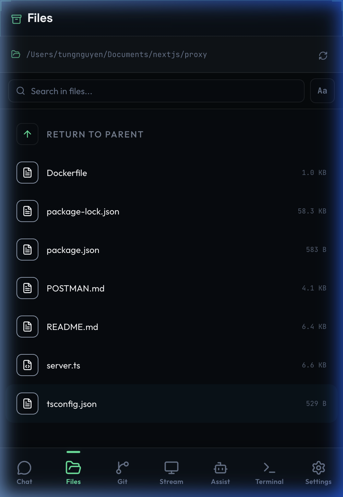
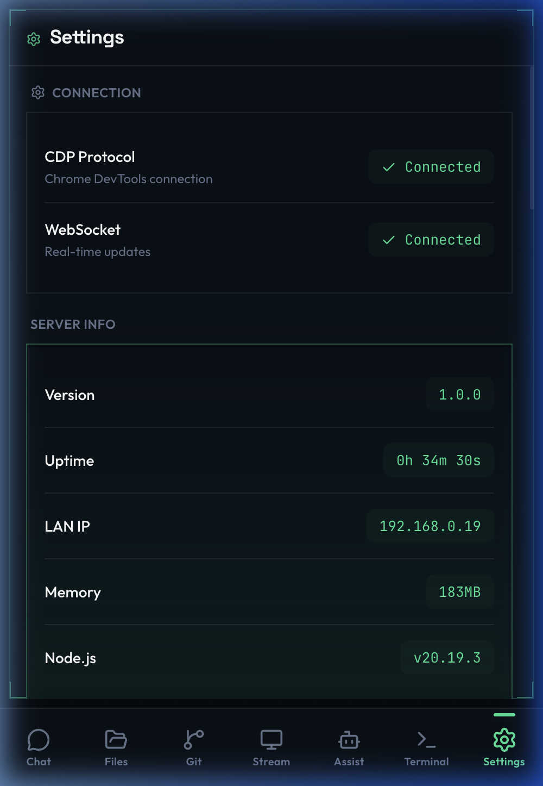
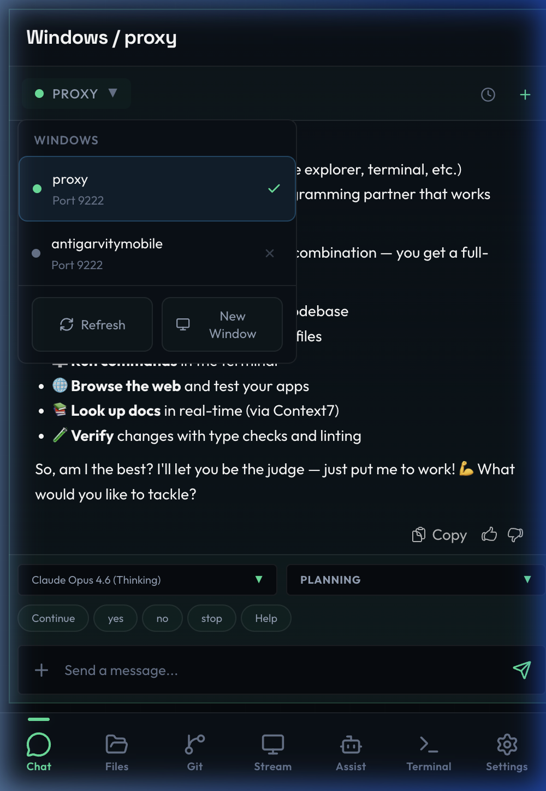
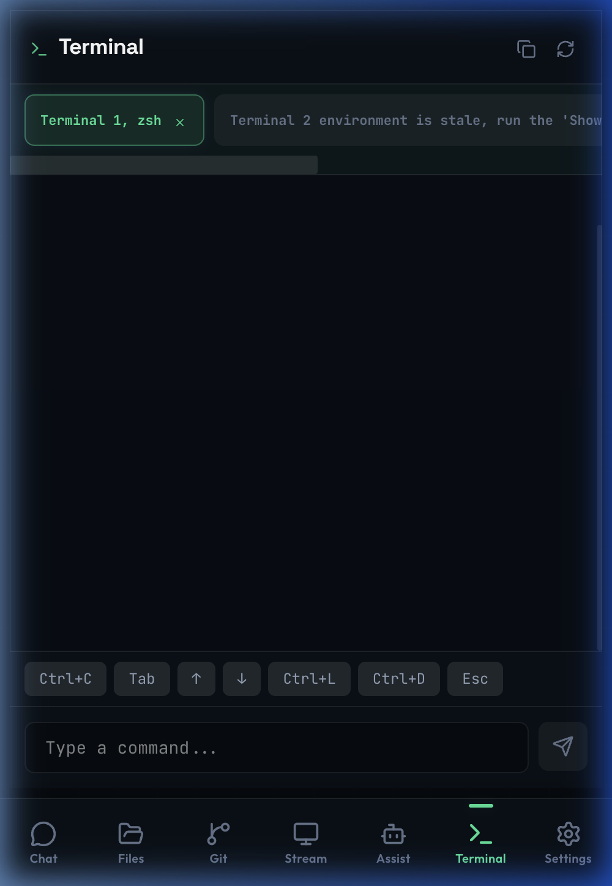
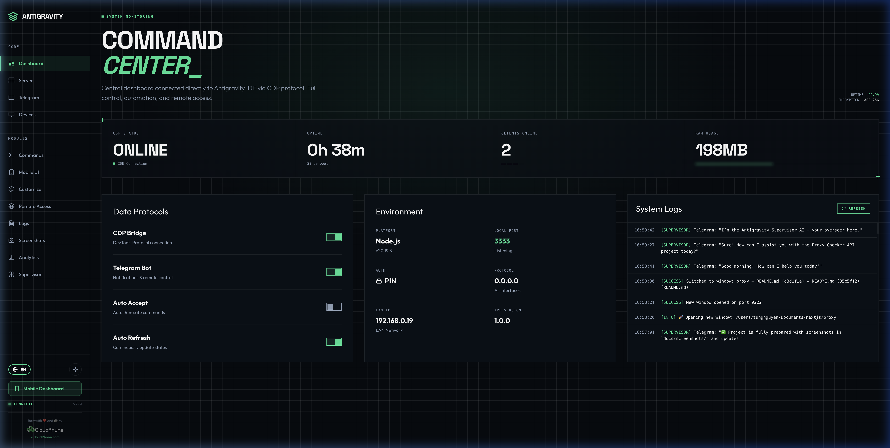

<p align="center">
  
</p>

<h1 align="center">Antigravity Mobile v2.0</h1>

<p align="center">
  <strong>Remote control panel for <a href="https://antigravity.google">Antigravity IDE</a> — monitor AI conversations, manage your agent, browse files, and stream your IDE screen — all from your phone.</strong>
</p>

<p align="center">
  
  
  
  
  
  
</p>

<p align="center">
  <strong>🇬🇧 English</strong> · <a href="README.vi.md">🇻🇳 Tiếng Việt</a>
</p>

---

> **Fork & Remix** of [mrkungfudn/antigravity-ide-mobile](https://github.com/mrkungfudn/antigravity-ide-mobile) — with custom UX improvements for mobile chat (fullscreen mode, send confirmation, iOS keyboard handling).

---

## ✨ What's New in v2.0

| Area | v1.x (Original) | v2.0 (This Fork) |
|------|-----------------|-------------------|
| **Frontend** | Vanilla JS + CSS in `public/` | Preact + Vite + Tailwind CSS SPA |
| **Backend** | Plain `.mjs` modules | TypeScript + Express with DI pattern |
| **Code Editor** | Basic syntax highlight | CodeMirror 6 with 15+ language support |
| **Themes** | 5 themes (dark/light/pastel) | 15+ modern themes (Command Center, Neon, Matrix, etc.) |
| **Panels** | Chat, Files, Settings | Chat, Files, **Git**, **Stream**, **Terminal**, Assist, Settings |
| **Admin Panel** | Single-page controls | 13 dedicated pages (Dashboard, Analytics, Supervisor, etc.) |
| **i18n** | English only | English + Vietnamese |
| **Navigation** | Fixed top tabs | Configurable: Top tabs / Bottom bar / Sidebar |
| **PWA** | Manual `sw.js` | `vite-plugin-pwa` with auto-update |
| **Streaming** | Screenshot polling | **Real-time CDP screencast** with click interaction |
| **Multi Windows** | ❌ | Multi-window CDP switching with workspace detection |
| **Scroll Sync** | ❌ | Phone scroll → Desktop IDE scroll sync via CDP |
| **File Open/Diff** | ❌ | Open file + diff view in IDE from mobile (CLI/CDP multi-strategy) |
| **Command Injection** | ❌ | Inject text into AI chat, submit, focus input remotely |
| **AI Model/Mode** | ❌ | Get/set AI model (Claude, Gemini, GPT) and mode (Planning/Fast) from phone |
| **Approvals** | ❌ | Detect & respond to pending agent approvals (approve/reject remotely) |
| **Quota Monitoring** | ❌ | Real-time model quota tracking (auto-discovers language server process) |
| **Preview Tunnels** | ❌ | Multi-instance tunnels — expose dev previews (e.g. `localhost:5173`) to internet |
| **Context Menu** | ❌ | Right-click any folder → "Open with Antigravity + MobileWork" |
| **Git** | ❌ | Full Git panel (status, diff, stage, commit, push, pull) |
| **Terminal** | ❌ | Remote terminal viewer |

---

## 📸 Screenshots

<p align="center">
  
  
  
  
  
</p>

<p align="center">
  <sub>Chat • Files • Settings • Multi Windows • Terminal</sub>
</p>

<p align="center">
  
</p>

<p align="center">
  <sub>Admin Command Center — full desktop dashboard</sub>
</p>

---

## 🚀 Features

### 📱 Mobile Dashboard

- **Live Chat** — Real-time streaming of AI conversations with morphdom incremental updates (sub-500ms latency). Chat history, search, and message injection
- **File Browser** — Navigate workspace files with CodeMirror 6 syntax highlighting for 15+ languages (TypeScript, Python, Rust, Go, PHP, Java, C++, etc.)
- **Git Panel** — Full Git integration: status, staged/unstaged diffs, commit, push, pull, branch management
- **Screen Stream** — Live CDP screencast of your IDE with touch-to-click interaction. Configurable quality and resolution
- **Terminal** — Remote terminal viewer for monitoring build output and shell sessions
- **AI Assist** — Chat with a local AI supervisor (Ollama-powered) for autonomous monitoring and error recovery
- **Settings** — Theme switcher (15+ themes), language selector, navigation mode, quick actions

### 🖥️ Admin Panel (`/admin`)

Full-featured localhost-only control panel with 13 pages:

| Page | Description |
|------|-------------|
| **Dashboard** | System overview — uptime, clients, CDP status, analytics |
| **Remote Access** | Cloudflare quick tunnels with QR code generation |
| **Telegram** | Bot notifications (completion, errors, input needed) |
| **Supervisor** | AI supervisor config — Ollama model, auto-recovery rules |
| **Commands** | Saved quick commands, injected directly into agent |
| **Screenshots** | Scheduled auto-capture timeline with WebP support |
| **Devices** | Multi-device CDP target switching |
| **Customize** | Mobile dashboard UI customization (tabs, layout, branding) |
| **Mobile** | Theme and navigation mode presets |
| **Server** | PIN auth, port config, restart controls |
| **Analytics** | Usage statistics and daily metrics |
| **Logs** | Session event logs with real-time streaming |
| **Screenshots** | Screenshot timeline with auto-rotation |

### 🔒 Security

- **PIN Authentication** — Optional 4–6 digit PIN with IP-based rate limiting (5 attempts, 15-min lockout)
- **Session Tokens** — SHA-256 hashed, per-device sessions
- **Localhost-only Admin** — All admin endpoints restricted to `127.0.0.1`
- **Cloudflare HTTPS** — Encrypted tunnels via `cloudflared`, no data exposed externally

### 🌐 Remote Access & Tunnels

- **Quick Tunnels** — One-click Cloudflare tunnels (no account needed), auto-generated `.trycloudflare.com` URL with QR code
- **Named Tunnels** — Custom domain tunnels via `cloudflared` config (requires account)
- **Preview Tunnels** — Expose any local port (e.g. `localhost:5173`) to the internet — perfect for sharing dev previews with teammates or testing on real devices
- **Multi-Instance** — Multiple tunnels running simultaneously (main server + preview ports)
- **Auto-Start** — Optional tunnel auto-launch on server boot
- **Orphan Cleanup** — Automatic detection and cleanup of orphaned `cloudflared` processes
- **State Persistence** — Tunnel config (URL, port, auto-start) saved to JSON, restored on restart

### 🎮 CDP Remote Control

All remote operations happen via Chrome DevTools Protocol — no IDE plugins needed:

- **Scroll Sync** — Phone scroll position mirrors to desktop IDE chat view
- **File Open / Diff** — Tap a file on mobile → opens in IDE editor (multi-strategy: CLI, CDP chat click, tab click). Diff view for comparing changes
- **Command Injection** — Type prompts on your phone, inject into IDE chat, submit or just focus the input field
- **AI Model/Mode Switching** — View and switch AI models (Claude, Gemini, GPT) and conversation modes (Planning/Fast) directly from mobile
- **Pending Approvals** — Detect when the AI agent needs approval, approve or reject remotely from your phone
- **Quota Monitoring** — Real-time model usage quotas (auto-discovers Antigravity language server process, extracts CSRF token from CLI args)

### 🤖 Telegram Bot

- Agent event notifications (task complete, input needed, errors detected)
- Remote screenshot capture via bot commands
- Status and quota queries from Telegram
- Per-event toggle controls

---

## 📦 Quick Start

**Requirements:** Node.js 18+, [Antigravity IDE](https://antigravity.google) installed

> 📖 For detailed Vietnamese installation guide, see [INSTALL.md](INSTALL.md).

```bash
# Clone
git clone https://github.com/ductho0409/antigravity-ide-mobile.git
cd antigravity-ide-mobile

# Install & build
cd client && npm install && npm run build && cd ..
cd server && npm install && npm run build && cd ..

# Start (development mode)
npm run dev

# Or install as macOS service (auto-start on login)
bash scripts/install-service.sh
```

**Or use the launcher scripts:**

| Platform | Start | Stop |
|----------|-------|------|
| **Windows** | `scripts/Start-Antigravity-Mobile.bat` | `scripts/Stop-Antigravity-Mobile.bat` |
| **macOS/Linux** | `scripts/Start-Antigravity-Mobile.sh` | `scripts/Stop-Antigravity-Mobile.sh` |

The launcher automatically:
- Installs dependencies on first run
- Launches Antigravity IDE with CDP enabled (`--remote-debugging-port=9222`)
- Starts the server and opens the admin panel

**Right-click context menu (optional):**

Add "Open with Antigravity + MobileWork" to your OS right-click menu — right-click any project folder to launch the IDE + mobile server instantly:

| Platform | Install |
|----------|---------|
| **Windows** | `scripts\Install-Context-Menu.bat` (adds registry entry, requires Admin) |
| **macOS** | `scripts/Install-Context-Menu.sh` (installs Finder Quick Action) |

**Access:**
- 📱 Mobile: `http://YOUR_PC_IP:3333` (from your phone, same Wi-Fi)
- 🖥️ Admin: `http://localhost:3333/admin`

---

## 🏗️ Architecture

```
┌──────────────────────────────────────────────────────────────┐
│  Your Machine                                                 │
│                                                               │
│  Antigravity IDE ◄────── CDP ──────► Server (:3333)           │
│                                       │         │             │
│                                  WebSocket    HTTPS           │
│                                       │         │             │
│                               Phone 📱    Telegram 🤖        │
│                                                               │
│  Optional: ─── Cloudflare Tunnel ──► Internet 🌐              │
└──────────────────────────────────────────────────────────────┘
```

### Tech Stack

| Layer | Technology |
|-------|-----------|
| **Frontend** | [Preact](https://preactjs.com/) + [Vite](https://vitejs.dev/) + [Tailwind CSS v4](https://tailwindcss.com/) |
| **Backend** | [Express](https://expressjs.com/) + TypeScript (ESM) |
| **Code Editor** | [CodeMirror 6](https://codemirror.net/) (lazy-loaded) |
| **Real-time** | WebSocket (native `ws`) + [morphdom](https://github.com/patrick-steele-idem/morphdom) |
| **IDE Bridge** | Chrome DevTools Protocol (CDP) |
| **PWA** | [vite-plugin-pwa](https://github.com/vite-pwa/vite-plugin-pwa) |
| **Icons** | [Lucide](https://lucide.dev/) (Preact bindings) |
| **AI Supervisor** | [Ollama](https://ollama.com/) REST API |
| **Tunnel** | [Cloudflare `cloudflared`](https://developers.cloudflare.com/cloudflare-one/connections/connect-networks/) |
| **Notifications** | [Telegram Bot API](https://core.telegram.org/bots/api) |

---

## 📁 Project Structure

```
antigravity-mobile/
├── client/                          # Preact frontend (v2.0)
│   ├── src/
│   │   ├── app.tsx                  # App shell — routing, layout, WebSocket
│   │   ├── components/
│   │   │   ├── ChatPanel.tsx        # Live chat with morphdom sync
│   │   │   ├── FilesPanel.tsx       # File browser + CodeMirror viewer
│   │   │   ├── GitPanel.tsx         # Git status, diff, staging, commits
│   │   │   ├── StreamPanel.tsx      # CDP screencast with click interaction
│   │   │   ├── TerminalPanel.tsx    # Remote terminal viewer
│   │   │   ├── AssistPanel.tsx      # AI supervisor chat
│   │   │   ├── SettingsPanel.tsx    # Theme, language, navigation config
│   │   │   ├── LoginScreen.tsx      # PIN authentication
│   │   │   ├── Sidebar.tsx          # Sidebar navigation mode
│   │   │   ├── BottomTabBar.tsx     # Bottom tab bar navigation mode
│   │   │   └── ...                  # Toast, PWA prompt, code editor, etc.
│   │   ├── hooks/
│   │   │   ├── useWebSocket.ts      # WebSocket connection manager
│   │   │   ├── useApi.ts            # authFetch wrapper
│   │   │   ├── useChatPolling.ts    # Chat snapshot polling
│   │   │   ├── useWindows.ts        # Multi-window CDP management
│   │   │   └── useTheme.ts          # Theme switching
│   │   ├── pages/admin/             # Admin panel (13 pages)
│   │   ├── i18n/                    # Internationalization (EN/VI)
│   │   ├── context/                 # Preact Context (global state)
│   │   └── styles/                  # CSS: variables, themes, layout, chat
│   ├── vite.config.ts               # Vite + PWA + Tailwind config
│   └── public/                      # PWA icons
│
├── server/                          # TypeScript Express backend (v2.0)
│   ├── src/
│   │   ├── index.ts                 # HTTP server, WebSocket, routing
│   │   ├── launcher.ts              # Startup orchestrator (IDE + CDP)
│   │   ├── config.ts                # JSON-file config store
│   │   ├── types.ts                 # Shared TypeScript types
│   │   ├── cdp/                     # Chrome DevTools Protocol modules
│   │   │   ├── core.ts              # CDP connection management
│   │   │   ├── chat-actions.ts      # Agent control (inject, auto-accept)
│   │   │   ├── chat-scrape.ts       # DOM scraping for chat content
│   │   │   ├── snapshot.ts          # Chat snapshot capture
│   │   │   ├── terminal.ts          # Terminal content extraction
│   │   │   ├── windows.ts           # Multi-window switching
│   │   │   ├── workspace.ts         # Workspace path detection
│   │   │   ├── file-ops.ts          # File operations via CDP
│   │   │   ├── model-mode.ts        # Model/mode detection
│   │   │   └── ...                  # Approvals, scroll, commands, queue
│   │   ├── services/
│   │   │   ├── chat-stream.ts       # Real-time chat streaming + notifications
│   │   │   ├── supervisor-service.ts # AI supervisor (Ollama-powered)
│   │   │   ├── telegram-bot.ts      # Telegram Bot integration
│   │   │   ├── tunnel.ts            # Cloudflare tunnel manager
│   │   │   ├── git-service.ts       # Git operations (status, diff, commit)
│   │   │   ├── quota-service.ts     # Model quota monitoring
│   │   │   ├── ollama-client.ts     # Ollama REST API wrapper
│   │   │   └── watchers.ts          # Screenshot scheduler
│   │   ├── routes/                  # Express route factories (DI pattern)
│   │   │   ├── admin.ts             # Admin panel API
│   │   │   ├── cdp.ts               # CDP + chat + streaming API
│   │   │   ├── files.ts             # File system API
│   │   │   ├── git.ts               # Git operations API
│   │   │   ├── auth.ts              # Authentication API
│   │   │   └── messages.ts          # Message + supervisor API
│   │   └── middleware/              # Auth middleware
│   └── tsconfig.json
│
├── scripts/                         # Launch/stop scripts (Win + Mac/Linux)
│   ├── install-service.sh           # macOS launchd service installer
│   ├── uninstall-service.sh         # macOS launchd service remover
│   └── start-server.sh              # Server startup script
├── data/                            # Runtime config & session data (gitignored)
├── INSTALL.md                       # Detailed installation guide (Vietnamese)
└── package.json                     # Monorepo root scripts
```

---

## ⚙️ Configuration

### Port

Default: `3333`. Change via environment variable:

```bash
PORT=3001 npm run dev
```

### PIN Authentication

Set via interactive prompt on startup, or environment variable:

```bash
MOBILE_PIN=1234 npm run dev
```

### Telegram Bot

1. Create a bot via [@BotFather](https://t.me/BotFather)
2. Get your chat ID from [@userinfobot](https://t.me/userinfobot)
3. Enter both in **Admin → Telegram** → Save & Connect

### Remote Access (Cloudflare Tunnel)

1. Install [`cloudflared`](https://developers.cloudflare.com/cloudflare-one/connections/connect-networks/downloads/) (the launcher offers to install automatically)
2. Enable PIN authentication first
3. Go to **Admin → Remote Access** → Start Tunnel
4. Share the generated URL or QR code

### CDP Connection

The launcher starts Antigravity IDE with CDP automatically. To connect manually:

```bash
# Default (port 9222 — may conflict with Chrome agent)
antigravity --remote-debugging-port=9222

# Recommended (port 9223 — avoids conflict)
/Applications/Antigravity.app/Contents/MacOS/Electron --remote-debugging-port=9223
```

> **Note:** Port `9222` is often occupied by Chrome (used by Antigravity's AI agent browser). Use port `9223` instead. Update `data/config.json` → `devices[0].cdpPort` to match.

---

## 🖥️ macOS Persistent Setup

Two options for running the server 24/7 as a background service:

### Option A: launchd (Recommended — zero dependencies)

The included install script creates a native macOS launchd user agent:

```bash
# Install service (auto-starts on login)
bash scripts/install-service.sh

# Service commands
launchctl unload ~/Library/LaunchAgents/com.antigravity.mobile-bridge.plist  # Stop
launchctl load   ~/Library/LaunchAgents/com.antigravity.mobile-bridge.plist  # Start

# View logs
tail -f logs/server.log

# Uninstall
bash scripts/uninstall-service.sh
```

### Option B: pm2 (Alternative)

```bash
npm install -g pm2
pm2 start ecosystem.config.cjs
pm2 startup launchd && pm2 save  # auto-start on boot
```

| Command | Description |
|---------|-------------|
| `pm2 status` | Check server status |
| `pm2 logs antigravity-mobile` | View live logs |
| `pm2 restart antigravity-mobile` | Restart server |

### Launch IDE with CDP

```bash
# Required: open Antigravity IDE with remote debugging
/Applications/Antigravity.app/Contents/MacOS/Electron --remote-debugging-port=9223
```

Or use the included script:

```bash
bash scripts/start-ide.sh
```

### Remote Access via Tailscale

If both your server machine and phone are on [Tailscale](https://tailscale.com/):

```
http://<TAILSCALE_IP>:3333
```

No port forwarding or Cloudflare tunnel needed — encrypted P2P access from anywhere.

---

## 🎨 Themes

15+ built-in themes with live preview:

| Dark Themes | Light Themes | Special |
|-------------|-------------|---------|
| Midnight | Light | Command Center |
| Neon Purple | Pastel | Command Light |
| Slate Blue | Soft White | Matrix |
| Cyber Teal | | Deep Ocean |
| Dark Ember | | Sunset Glow |
| Nord Dark | | Sakura |

Themes are configured per-device and persist across sessions.

---

## 🌍 Internationalization

Full i18n support with two locales:

- 🇬🇧 **English** (default)
- 🇻🇳 **Tiếng Việt**

All UI strings, labels, and messages are translatable. Switch language in **Settings → Language**.

---

## 🔧 Troubleshooting

| Problem | Fix |
|---------|-----|
| CDP not connecting | Use port `9223` instead of `9222`. Launch IDE: `/Applications/Antigravity.app/Contents/MacOS/Electron --remote-debugging-port=9223` |
| CDP shows Chrome, not IDE | Port 9222 is used by Chrome agent. Change to 9223 in `data/config.json` |
| Can't access from phone | Same Wi-Fi? Try PC's IP instead of `localhost`. Check firewall for port 3333 |
| iOS keyboard hides input | Clear browser cache and reload — v2.0 includes `visualViewport` fix |
| Server keeps dying | Use `pm2 start ecosystem.config.cjs` for auto-restart |
| Telegram not sending | Verify token + chat ID. Check Admin → Telegram toggles |
| Stream lag | Lower quality in Stream panel settings. Check network bandwidth |
| Build errors | Run `cd client && npm install && cd ../server && npm install` |
| PIN forgotten | Click **Clear PIN** in Admin → Server, or restart without PIN |
| Tunnel won't start | Ensure `cloudflared` installed and PIN auth enabled |

Debug mode:

```bash
cd server && npm run dev 2>&1 | tee server.log
```

---

## 💚 Sponsored by

<p align="center">
  <a href="https://xcloudphone.com?utm_source=AntigravityMobile" target="_blank">
    
  </a>
  <br />
  <a href="https://xcloudphone.com?utm_source=AntigravityMobile" target="_blank"><strong>xCloudPhone.com</strong></a>
  <br />
  <sub>Cloud phone number service — supporting open source projects</sub>
</p>

---

## 📜 License

MIT — see [LICENSE](LICENSE).

## 🙏 Acknowledgments

- Original project by [AvenalJ](https://github.com/AvenalJ/Antigravity-Mobile)
- Inspired by [Antigravity-Shit-Chat](https://github.com/gherghett/Antigravity-Shit-Chat) by gherghett
- Quota monitoring inspired by [Antigravity Cockpit](https://marketplace.visualstudio.com/items?itemName=jlcodes.antigravity-cockpit)

---

<p align="center">
  <sub>Built with ❤️ for the Antigravity community</sub>
</p>
