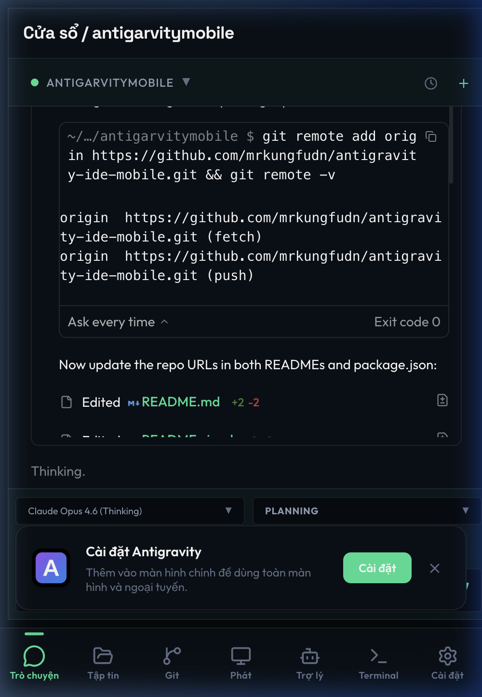
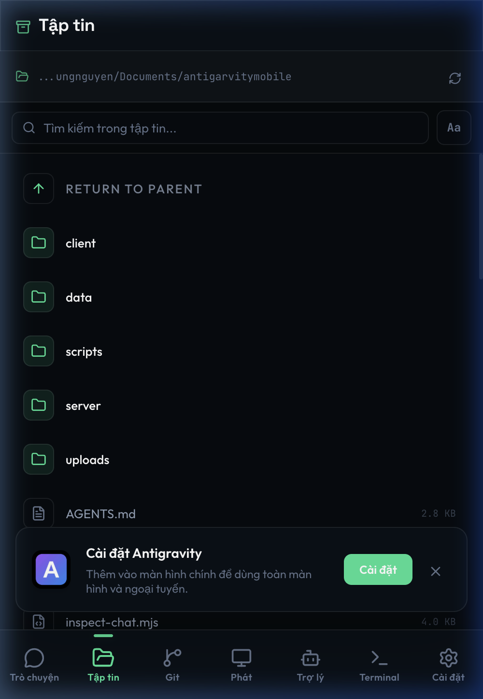
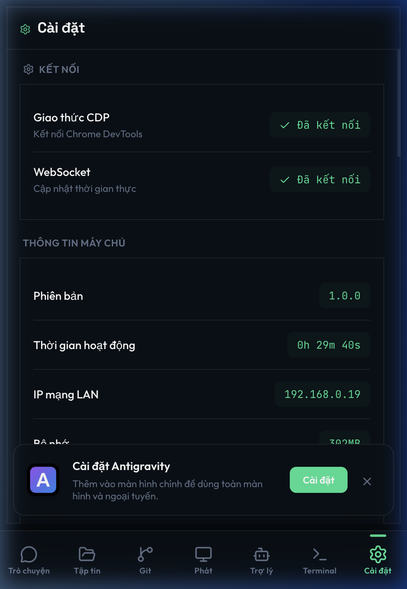
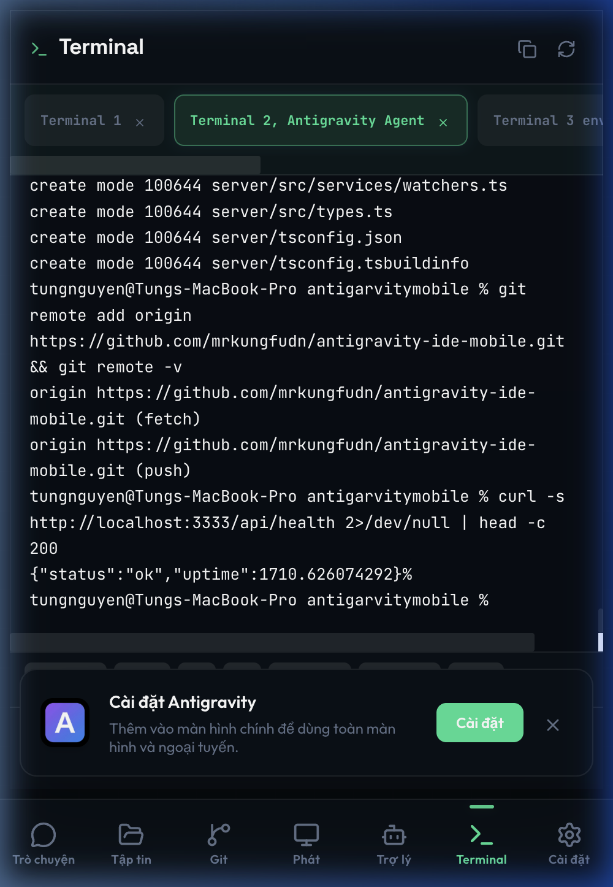

<p align="center">
  
</p>

<h1 align="center">Antigravity Mobile v2.0</h1>

<p align="center">
  <strong>Bảng điều khiển từ xa cho <a href="https://antigravity.google">Antigravity IDE</a> — theo dõi AI, quản lý agent, duyệt file và stream màn hình IDE — tất cả từ điện thoại của bạn.</strong>
</p>

<p align="center">
  
  
  
  
  
  
</p>

<p align="center">
  <a href="README.md">🇬🇧 English</a> · <strong>🇻🇳 Tiếng Việt</strong>
</p>

---

> **Fork & Remix** từ [AvenalJ/Antigravity-Mobile](https://github.com/AvenalJ/Antigravity-Mobile) — viết lại toàn bộ từ vanilla JS sang monorepo TypeScript hiện đại với Preact, Vite, Tailwind CSS và CodeMirror 6.

---

## ✨ Có gì mới ở v2.0

| Hạng mục | v1.x (Bản gốc) | v2.0 (Bản này) |
|----------|----------------|----------------|
| **Frontend** | Vanilla JS + CSS trong `public/` | Preact + Vite + Tailwind CSS SPA |
| **Backend** | Module `.mjs` thuần | TypeScript + Express với DI pattern |
| **Code Editor** | Highlight cơ bản | CodeMirror 6 hỗ trợ 15+ ngôn ngữ |
| **Theme** | 5 theme (dark/light/pastel) | 15+ theme hiện đại (Command Center, Neon, Matrix...) |
| **Panel** | Chat, Files, Settings | Chat, Files, **Git**, **Stream**, **Terminal**, Assist, Settings |
| **Admin** | Một trang duy nhất | 13 trang chuyên biệt (Dashboard, Analytics, Supervisor...) |
| **Ngôn ngữ** | Chỉ tiếng Anh | Tiếng Anh + Tiếng Việt |
| **Navigation** | Tab trên cùng cố định | Tùy chỉnh: Tab trên / Tab dưới / Sidebar |
| **PWA** | `sw.js` thủ công | `vite-plugin-pwa` tự động cập nhật |
| **Streaming** | Chụp ảnh polling | **Screencast CDP real-time** với click tương tác |
| **Multi Windows** | ❌ | Chuyển đổi đa cửa sổ CDP với phát hiện workspace |
| **Scroll Sync** | ❌ | Cuộn trên điện thoại → IDE desktop cuộn đồng bộ qua CDP |
| **Mở file/Diff** | ❌ | Mở file + xem diff trong IDE từ điện thoại (CLI/CDP đa chiến lược) |
| **Inject lệnh** | ❌ | Nhập text vào chat AI, gửi, focus input từ xa |
| **AI Model/Mode** | ❌ | Đổi model AI (Claude, Gemini, GPT) và chế độ (Planning/Fast) từ điện thoại |
| **Phê duyệt** | ❌ | Phát hiện & phản hồi yêu cầu phê duyệt agent (approve/reject từ xa) |
| **Quota** | ❌ | Theo dõi quota model real-time (tự phát hiện language server) |
| **Preview Tunnels** | ❌ | Tunnel đa instance — expose preview dev (VD: `localhost:5173`) ra internet |
| **Context Menu** | ❌ | Nhấp chuột phải thư mục → "Open with Antigravity + MobileWork" |
| **Git** | ❌ | Panel Git đầy đủ (status, diff, stage, commit, push, pull) |
| **Terminal** | ❌ | Xem terminal từ xa |

---

## 📸 Ảnh chụp màn hình

<p align="center">
  
  
  
  
  
</p>

<p align="center">
  <sub>Trò chuyện • Tập tin • Cài đặt • Multi Windows • Terminal</sub>
</p>

<p align="center">
  
</p>

<p align="center">
  <sub>Admin Command Center — bảng điều khiển desktop</sub>
</p>

---

## 🚀 Tính năng

### 📱 Dashboard Di Động

- **Chat Trực Tiếp** — Streaming cuộc trò chuyện AI real-time với morphdom (độ trễ <500ms). Lịch sử chat, tìm kiếm, gửi tin nhắn trực tiếp vào agent
- **Trình Duyệt File** — Duyệt workspace với CodeMirror 6 syntax highlight cho 15+ ngôn ngữ (TypeScript, Python, Rust, Go, PHP, Java, C++...)
- **Panel Git** — Tích hợp Git đầy đủ: trạng thái, diff staged/unstaged, commit, push, pull, quản lý branch
- **Stream Màn Hình** — Screencast CDP trực tiếp từ IDE với tương tác touch-to-click. Tùy chỉnh chất lượng và độ phân giải
- **Terminal** — Xem terminal từ xa để theo dõi build output và shell
- **Trợ Lý AI** — Chat với AI supervisor cục bộ (Ollama) cho giám sát tự động và phục hồi lỗi
- **Cài Đặt** — Chuyển theme (15+), chọn ngôn ngữ, chế độ navigation, hành động nhanh

### 🖥️ Bảng Admin (`/admin`)

Bảng điều khiển localhost-only đầy đủ với 13 trang:

| Trang                   | Mô tả                                                           |
| ----------------------- | ----------------------------------------------------------------- |
| **Dashboard**     | Tổng quan — uptime, clients, CDP, analytics                     |
| **Remote Access** | Cloudflare tunnel với QR code                                    |
| **Telegram**      | Bot thông báo (hoàn thành, lỗi, cần input)                  |
| **Supervisor**    | Cấu hình AI supervisor — model Ollama, quy tắc tự phục hồi |
| **Commands**      | Lệnh nhanh đã lưu, inject trực tiếp vào agent              |
| **Screenshots**   | Timeline chụp ảnh tự động với WebP                          |
| **Devices**       | Chuyển đổi CDP đa thiết bị                                  |
| **Customize**     | Tùy chỉnh giao diện mobile (tab, layout, branding)             |
| **Mobile**        | Preset theme và chế độ navigation                             |
| **Server**        | PIN auth, cấu hình port, nút restart                           |
| **Analytics**     | Thống kê sử dụng và metrics hàng ngày                      |
| **Logs**          | Log sự kiện phiên làm việc real-time                         |
| **Screenshots**   | Timeline screenshot với xoay tự động                          |

### 🔒 Bảo mật

- **Xác thực PIN** — PIN 4–6 chữ số tùy chọn với giới hạn IP (5 lần thử, khóa 15 phút)
- **Session Token** — Hash SHA-256, phiên riêng theo thiết bị
- **Admin chỉ Localhost** — Tất cả endpoint admin giới hạn `127.0.0.1`
- **HTTPS Cloudflare** — Tunnel mã hóa qua `cloudflared`, không lộ dữ liệu ra ngoài

### 🌐 Truy Cập Từ Xa & Tunnel

- **Quick Tunnel** — Cloudflare tunnel một nút (không cần tài khoản), tự tạo URL `.trycloudflare.com` kèm QR code
- **Named Tunnel** — Tunnel domain tùy chỉnh qua config `cloudflared` (cần tài khoản)
- **Preview Tunnel** — Expose bất kỳ port local nào (VD: `localhost:5173`) ra internet — chia sẻ preview dev cho đồng đội hoặc test trên thiết bị thật
- **Multi-Instance** — Nhiều tunnel chạy song song (server chính + các port preview)
- **Auto-Start** — Tùy chọn tự khởi động tunnel cùng server
- **Dọn dẹp orphan** — Tự phát hiện và dọn các tiến trình `cloudflared` bị mồ côi
- **Lưu trạng thái** — Config tunnel (URL, port, auto-start) lưu JSON, khôi phục khi restart

### 🎮 Điều Khiển Từ Xa qua CDP

Mọi thao tác từ xa đều qua Chrome DevTools Protocol — không cần plugin IDE:

- **Scroll Sync** — Cuộn trên điện thoại → IDE desktop cuộn theo đồng bộ
- **Mở file / Diff** — Nhấn file trên điện thoại → mở trong IDE (đa chiến lược: CLI, CDP click chat, click tab). Xem diff so sánh thay đổi
- **Inject lệnh** — Gõ prompt trên điện thoại, inject vào chat IDE, gửi hoặc chỉ focus input
- **Đổi AI Model/Mode** — Xem và chuyển model AI (Claude, Gemini, GPT) và chế độ (Planning/Fast) trực tiếp từ mobile
- **Phê duyệt** — Phát hiện khi agent cần phê duyệt, approve hoặc reject từ xa trên điện thoại
- **Theo dõi Quota** — Quota model real-time (tự phát hiện language server, trích xuất CSRF token từ CLI args)

### 🤖 Telegram Bot

- Thông báo sự kiện agent (hoàn thành, cần input, phát hiện lỗi)
- Chụp screenshot từ xa qua lệnh bot
- Truy vấn trạng thái và quota từ Telegram
- Bật/tắt từng loại thông báo

---

## 📦 Bắt Đầu Nhanh

**Yêu cầu:** Node.js 18+, đã cài [Antigravity IDE](https://antigravity.google)

```bash
# Clone
git clone https://github.com/mrkungfudn/antigravity-ide-mobile.git
cd antigravity-ide-mobile

# Cài đặt & build
cd client && npm install && npm run build && cd ..
cd server && npm install && npm run build && cd ..

# Chạy
npm run dev
```

**Hoặc dùng script khởi chạy:**

| Nền tảng            | Khởi động                             | Dừng                                   |
| --------------------- | ---------------------------------------- | --------------------------------------- |
| **Windows**     | `scripts/Start-Antigravity-Mobile.bat` | `scripts/Stop-Antigravity-Mobile.bat` |
| **macOS/Linux** | `scripts/Start-Antigravity-Mobile.sh`  | `scripts/Stop-Antigravity-Mobile.sh`  |

Launcher tự động:

- Cài dependencies lần đầu
- Khởi chạy Antigravity IDE với CDP (`--remote-debugging-port=9222`)
- Khởi động server và mở admin panel

**Menu chuột phải (tùy chọn):**

Thêm "Open with Antigravity + MobileWork" vào menu chuột phải — nhấp chuột phải bất kỳ thư mục project nào để khởi chạy IDE + mobile server ngay lập tức:

| Nền tảng        | Cài đặt                                                                      |
| --------------- | ------------------------------------------------------------------------------- |
| **Windows**     | `scripts\Install-Context-Menu.bat` (thêm registry, cần quyền Admin) |
| **macOS**       | `scripts/Install-Context-Menu.sh` (cài Finder Quick Action)                    |

**Truy cập:**

- 📱 Mobile: `http://IP_MÁY_BẠN:3333` (cùng Wi-Fi)
- 🖥️ Admin: `http://localhost:3333/admin`

---

## 🏗️ Kiến Trúc

```
┌──────────────────────────────────────────────────────────────┐
│  Máy của bạn                                                  │
│                                                               │
│  Antigravity IDE ◄────── CDP ──────► Server (:3333)           │
│                                       │         │             │
│                                  WebSocket    HTTPS           │
│                                       │         │             │
│                            Điện thoại 📱  Telegram 🤖        │
│                                                               │
│  Tùy chọn: ─── Cloudflare Tunnel ──► Internet 🌐             │
└──────────────────────────────────────────────────────────────┘
```

### Công Nghệ Sử Dụng

| Tầng                   | Công nghệ                                                                                               |
| ----------------------- | --------------------------------------------------------------------------------------------------------- |
| **Frontend**      | [Preact](https://preactjs.com/) + [Vite](https://vitejs.dev/) + [Tailwind CSS v4](https://tailwindcss.com/)        |
| **Backend**       | [Express](https://expressjs.com/) + TypeScript (ESM)                                                         |
| **Code Editor**   | [CodeMirror 6](https://codemirror.net/) (lazy-load)                                                          |
| **Real-time**     | WebSocket (`ws`) + [morphdom](https://github.com/patrick-steele-idem/morphdom)                             |
| **IDE Bridge**    | Chrome DevTools Protocol (CDP)                                                                            |
| **PWA**           | [vite-plugin-pwa](https://github.com/vite-pwa/vite-plugin-pwa)                                               |
| **Icons**         | [Lucide](https://lucide.dev/) (Preact)                                                                       |
| **AI Supervisor** | [Ollama](https://ollama.com/) REST API                                                                       |
| **Tunnel**        | [Cloudflare `cloudflared`](https://developers.cloudflare.com/cloudflare-one/connections/connect-networks/) |
| **Thông báo**   | [Telegram Bot API](https://core.telegram.org/bots/api)                                                       |

---

## 📁 Cấu Trúc Dự Án

```
antigravity-mobile/
├── client/                          # Frontend Preact (v2.0)
│   ├── src/
│   │   ├── app.tsx                  # App shell — routing, layout, WebSocket
│   │   ├── components/
│   │   │   ├── ChatPanel.tsx        # Chat trực tiếp với morphdom sync
│   │   │   ├── FilesPanel.tsx       # Duyệt file + CodeMirror viewer
│   │   │   ├── GitPanel.tsx         # Git: status, diff, staging, commits
│   │   │   ├── StreamPanel.tsx      # CDP screencast với click tương tác
│   │   │   ├── TerminalPanel.tsx    # Xem terminal từ xa
│   │   │   ├── AssistPanel.tsx      # Chat AI supervisor
│   │   │   ├── SettingsPanel.tsx    # Theme, ngôn ngữ, navigation
│   │   │   ├── LoginScreen.tsx      # Xác thực PIN
│   │   │   └── ...                  # Toast, PWA prompt, code editor...
│   │   ├── hooks/                   # Custom hooks (WebSocket, API, theme...)
│   │   ├── pages/admin/             # Admin panel (13 trang)
│   │   ├── i18n/                    # Đa ngôn ngữ (EN/VI)
│   │   ├── context/                 # Preact Context (state toàn cục)
│   │   └── styles/                  # CSS: variables, themes, layout, chat
│   └── vite.config.ts               # Cấu hình Vite + PWA + Tailwind
│
├── server/                          # Backend TypeScript Express (v2.0)
│   ├── src/
│   │   ├── index.ts                 # HTTP server, WebSocket, routing
│   │   ├── launcher.ts              # Điều phối khởi động (IDE + CDP)
│   │   ├── cdp/                     # Các module Chrome DevTools Protocol
│   │   ├── services/                # Dịch vụ: chat-stream, telegram, tunnel, git...
│   │   ├── routes/                  # Express routes (DI pattern)
│   │   └── middleware/              # Auth middleware
│   └── tsconfig.json
│
├── scripts/                         # Script khởi động/dừng (Windows + Mac/Linux)
├── data/                            # Config & session data (gitignored)
└── package.json                     # Script monorepo root
```

---

## ⚙️ Cấu Hình

### Port

Mặc định: `3333`. Thay đổi qua biến môi trường:

```bash
PORT=3001 npm run dev
```

### Xác thực PIN

Cài đặt qua prompt khi khởi động, hoặc biến môi trường:

```bash
MOBILE_PIN=1234 npm run dev
```

### Telegram Bot

1. Tạo bot qua [@BotFather](https://t.me/BotFather)
2. Lấy chat ID từ [@userinfobot](https://t.me/userinfobot)
3. Nhập cả hai vào **Admin → Telegram** → Save & Connect

### Truy Cập Từ Xa (Cloudflare Tunnel)

1. Cài [`cloudflared`](https://developers.cloudflare.com/cloudflare-one/connections/connect-networks/downloads/) (launcher sẽ hỏi cài tự động)
2. Bật xác thực PIN trước
3. Vào **Admin → Remote Access** → Start Tunnel
4. Chia sẻ URL hoặc QR code

### Kết nối CDP

Launcher tự khởi chạy Antigravity IDE với CDP. Nếu muốn kết nối thủ công:

```bash
antigravity --remote-debugging-port=9222
```

---

## 🎨 Theme

15+ theme có sẵn với xem trước trực tiếp:

| Theme tối  | Theme sáng | Đặc biệt    |
| ----------- | ----------- | -------------- |
| Midnight    | Light       | Command Center |
| Neon Purple | Pastel      | Command Light  |
| Slate Blue  | Soft White  | Matrix         |
| Cyber Teal  |             | Deep Ocean     |
| Dark Ember  |             | Sunset Glow    |
| Nord Dark   |             | Sakura         |

Theme được lưu theo thiết bị và giữ qua các phiên làm việc.

---

## 🌍 Đa Ngôn Ngữ

Hỗ trợ đầy đủ i18n với hai ngôn ngữ:

- 🇬🇧 **English** (mặc định)
- 🇻🇳 **Tiếng Việt**

Tất cả chuỗi UI, nhãn, tin nhắn đều có thể dịch. Chuyển ngôn ngữ tại **Cài Đặt → Ngôn Ngữ**.

---

## 🔧 Xử Lý Sự Cố

| Vấn đề                                  | Cách khắc phục                                                                    |
| ------------------------------------------ | ------------------------------------------------------------------------------------ |
| CDP không kết nối                       | Khởi chạy Antigravity qua launcher, hoặc thêm `--remote-debugging-port=9222`   |
| Không truy cập được từ điện thoại | Cùng Wi-Fi? Thử IP máy tính thay vì `localhost`. Kiểm tra firewall port 3333 |
| Telegram không gửi                       | Xác minh token + chat ID. Kiểm tra bật/tắt trong Admin → Telegram               |
| Stream bị lag                             | Giảm chất lượng trong cài đặt Stream panel. Kiểm tra băng thông mạng      |
| Lỗi build                                 | Chạy `cd client && npm install && cd ../server && npm install`                    |
| Quên PIN                                  | Nhấn**Clear PIN** tại Admin → Server, hoặc restart không dùng PIN        |
| Tunnel không khởi động                 | Đảm bảo đã cài `cloudflared` và bật xác thực PIN                         |

Chế độ debug:

```bash
cd server && npm run dev 2>&1 | tee server.log
```

---

## 💚 Được tài trợ bởi

<p align="center">
  <a href="https://xcloudphone.com" target="_blank">
    
  </a>
  <br />
  <a href="https://xcloudphone.com?utm_source=AntigravityMobile" target="_blank"><strong>xCloudPhone.com</strong></a>
  <br />
  <sub>Dịch vụ Cloud Phone — đồng hành cùng dự án mã nguồn mở</sub>
</p>

---

## 📜 Giấy phép

MIT — xem [LICENSE](LICENSE).

## 🙏 Lời cảm ơn

- Dự án gốc bởi [AvenalJ](https://github.com/AvenalJ/Antigravity-Mobile)
- Lấy cảm hứng từ [Antigravity-Shit-Chat](https://github.com/gherghett/Antigravity-Shit-Chat) bởi gherghett
- Giám sát quota lấy cảm hứng từ [Antigravity Cockpit](https://marketplace.visualstudio.com/items?itemName=jlcodes.antigravity-cockpit)

---

<p align="center">
  <sub>Xây dựng với ❤️ cho cộng đồng Antigravity</sub>
</p>
